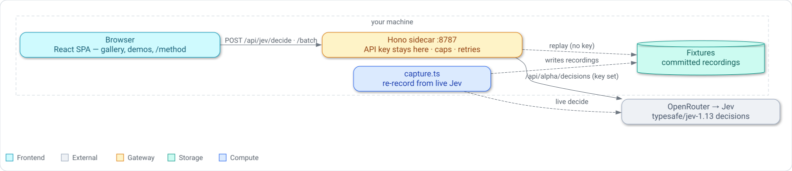

# Jev POC

> A hands-on tour of **Jev**, TypeSafe's first *System One* model — a model that returns typed, calibrated decisions instead of prose — in twenty demos across seven shapes.

[](https://github.com/garygentry/jev-poc/actions/workflows/ci.yml) [](.nvmrc) [](https://www.typescriptlang.org/) [](LICENSE)

Jev does not generate text.
You send it `state` plus a map of named `questions`, and it returns typed answers with calibrated probabilities.
There is no prose to parse and no free-text-to-struct failure mode, because the output is constrained to the options you supplied — so the interesting work moves out of prompt engineering and into ordinary code.

```jsonc
// POST https://openrouter.ai/api/alpha/decisions
{
  "model": "typesafe/jev-1.13",
  "state": { "ticket": "Stripe payouts have been failing for three days." },
  "questions": {
    "department":  { "type": "choice", "instructions": "Which team should handle this.",
                     "criteria": { "billing": "…", "technical": "…", "other": "None of the above." } },
    "impact":      { "type": "score",  "instructions": "How much harm right now.",
                     "criteria": ["No harm.", "Inconvenience.", "Active revenue loss."] },
    "is_urgent":   { "type": "noul",   "instructions": "The message conveys urgency." }
  }
}
```

```jsonc
{
  "answers": {
    "department": { "type": "choice", "choice": "technical",
                    "probabilities": { "technical": 0.907, "billing": 0.071, "other": 0.022 },
                    "confidence": 0.88 },
    "impact":     { "type": "score",  "score": 1.83, "confidence": 0.79, "probabilities": { … } },
    "is_urgent":  { "type": "noul",   "noul": 0.96 }
  },
  "usage": { "input_tokens": 471, "output_tokens": 84, "cost": 0.000019782 }
}
```

> [!NOTE]
> An independent proof-of-concept — not affiliated with or endorsed by TypeSafe or OpenRouter.
> It calls an `alpha` endpoint that may change or disappear without notice; see [Notes that cost something to learn](#notes-that-cost-something-to-learn).

## Quickstart

Requires Node 22+ and [pnpm](https://pnpm.io/installation).

```sh
git clone https://github.com/garygentry/jev-poc.git && cd jev-poc
pnpm install
cp .env.example .env     # optional — paste an OpenRouter key to go live
pnpm dev                 # client on :5180, sidecar on :8787
```

Open <http://localhost:5180>.
It works with **no key**: every demo replays a committed fixture and badges itself as doing so.
To go live, put an [OpenRouter key](https://openrouter.ai/settings/keys) in `.env` and restart.

## Architecture

<picture>
  <source media="(prefers-color-scheme: dark)" srcset="assets/architecture.dark.svg" />
  <source media="(prefers-color-scheme: light)" srcset="assets/architecture.light.svg" />
  
</picture>

```
shared/jev.ts          the wire contract, used verbatim by both sides
server/                Hono server; production also serves the built SPA
  transport.ts         bounded retries, timeouts, strict response validation
  routes.ts            /api/health · /api/jev/decide · /api/jev/batch · /api/chat
  access.ts            optional Cloudflare Access JWT verification at the origin
  config.ts            fan-out caps (8 concurrent, 200 rows), clamped server-side
  concurrency.ts       the bounded worker pool the fan-outs run through
  fixtures.ts          replay when no key is set
  spend.ts             the running token/dollar meter, fed only by real usage
src/
  demos/_kit/          the shared spine: DemoScaffold, runners/, registry, types
  demos/<slug>/        demo.ts (manifest) · policy.ts · policy.test.ts · view.tsx · Demo.tsx
  components/          ui/ · layout/ (DemoFrame) · jev/ (the instrument primitives)
  pages/               Gallery · DemoPage · Method
fixtures/              per-demo recorded responses
scripts/capture.ts     re-record them from live Jev
e2e/                   Playwright: contract sweep · per-slug specs · shell · api · errors · responsive · method
```

Every demo is one **manifest** (`demo.ts`) — its shape, primitives, questions and examples — wired to a **view** by a shared runner from `demos/_kit/runners/`.
Adding a demo is a directory plus one line in `e2e/helpers.ts`; no central file grows.

**Policy lives in code, not in the model.**
Every demo's thresholds and branching are plain TypeScript that you can read, unit-test and retune without re-running inference — and each demo renders its own policy source beside the verdict, with the branches that fired highlighted.
That is why the test suite runs offline: model quality is measured against your data, policy correctness by tests that finish in milliseconds.

**Fan-out is capped server-side**: 8 concurrent, 200 rows, clamped in `server/config.ts` rather than trusted from the browser.
A running token and dollar meter sits in the header, fed only by real `usage` blocks.

## The three primitives

| | Answers | Returns |
|---|---|---|
| **Choice** | Which one of these? | The winner, the full distribution, and a confidence |
| **Score** | Where on this rubric? | A probability-weighted mean that can land *between* levels, plus a confidence |
| **Noul** | Does this hold? | A probability 0–1. No separate confidence — the probability *is* the answer |

Pick by what the answer **means**, not by taste.
One of a fixed set is a Choice; a degree along a described dimension is a Score; whether a condition holds is a Noul.
They are not three flavours of classifier.

## The seven shapes

Every demo is a different **shape**, not a different topic.
This is the organising idea: questions batch into one request *only when they share state*.
Asking seven questions about one ticket costs about what asking one costs; twenty-four passages cannot share a state, so they fan out instead.

| Shape | What it does |
|---|---|
| **single** | One state, N questions, one request — the base case, and the cheapest. |
| **fanout** | N states judged against one shared question set, fanned out under the server's cap. |
| **pairwise** | Blocked N×N comparisons, then fanned out — for grouping items by "same or not". |
| **rounds** | Sequential: each round's questions are built from the last round's answers. |
| **windowed** | A sliding window over one input too long for the context, then aggregated. |
| **cascade** | A cheap Jev gate first, then an expensive model only for the cases the gate lets through. |
| **offline** | No calls at all — it works on answers already recorded, so it spends nothing. |

`fanout`, `pairwise` and `windowed` are the three whose cost grows with input; they are badged for it and never fire on render.

## The twenty demos

Read `/method` in the app for the long version; each demo's page shows its shape, its policy source, and the branches that fired.

### Foundations — the primitives and the one rule

| # | Demo | Shape | Shows |
|---|---|---|---|
| 1 | Ticket triage | single | Seven narrow questions beat one broad prompt; policy in code; thresholds scaled to stakes |
| 2 | Command guardrail | single | An agent permission gate in the open, and why severity ordering matters |
| 3 | Semantic re-rank | fanout | Probability as a sort key over 24 passages; *ties are not rankings* |
| 4 | Live typewriter | single | What ~100ms buys: twelve judgements repainting as you type |
| 5 | Taxonomy beam search | rounds | Reading the **distribution**, not the winner; confidence deciding depth |
| 6 | Model router | single | The agent control plane; a hundredth of a cent to save a dollar |
| 7 | Bulk labelling | fanout | Free output tokens change the arithmetic; confidence as a human-review queue |
| 8 | Persona panel | fanout | Probability across a *population* of twelve readers, and where the mean lies |

### Control plane — building the agent loop

| # | Demo | Shape | Shows |
|---|---|---|---|
| 9 | Cascade router | cascade | Gate for a hundredth of a cent, pay the frontier only when it earns it |
| 10 | Context pruner | fanout | The saving is the tokens you never send |
| 11 | Done-check | single | One noul per acceptance criterion, against the evidence — not the agent's word |
| 12 | Loop detector | windowed | Read "no progress" off the trace, instead of counting steps |

### Engineering — decisions over code and CI

| # | Demo | Shape | Shows |
|---|---|---|---|
| 13 | PR risk triage | single | Route review attention by risk, instead of reading every diff alike |
| 14 | Flaky vs regression | single | Classify a CI failure before an auto-retry hides a real one |
| 15 | Alert dedup | pairwise | Group alerts by incident, not by the template they happen to share |
| 16 | Semantic grep | fanout | Search by a rule stated in English — the regex nobody can write |

### Safety

| # | Demo | Shape | Shows |
|---|---|---|---|
| 17 | Multi-policy moderation | single | Twelve policies in one request, each with its own threshold |

### Documents — long text

| # | Demo | Shape | Shows |
|---|---|---|---|
| 18 | Clause risk | fanout | Read every clause on every risk — surface only the ones that carry it |
| 19 | Long-document sweep | windowed | Chunk, judge, aggregate — and say what chunking costs |

### Method — the shape with no calls

| # | Demo | Shape | Shows |
|---|---|---|---|
| 20 | Threshold fitter | offline | Fit the number every other demo guesses — for free, from recorded answers |

## Testing

```sh
pnpm test        # 193 unit tests — pure policy and server logic, no key, no network
pnpm e2e         # 150 end-to-end tests — starts its own fixture-mode server
pnpm typecheck
pnpm build
pnpm capture     # re-record the fixtures against live Jev (needs a key)
```

The two suites divide the work.
**Vitest** covers the pure policy functions — routing, confidence gates, beam pruning, rank bounds, windowed aggregation, pairwise clustering, cost math — which is where the logic that can actually be wrong lives.
**Playwright** covers what unit tests cannot: that the app renders, that a request reaches the sidecar and comes back, that fan-outs are capped and never fire on render, that failures degrade instead of white-screening, and that replayed data is never presented as live.

`pnpm e2e` starts its own server on ports 5181/8788 with the key blanked, so it runs beside your dev server, costs nothing, and is deterministic — asserting on live model output would be flaky by construction.
To exercise the suite against real answers, run `pnpm capture` first and it will assert against what the model actually said.

CI runs typecheck, unit tests, build, the end-to-end suite and a [gitleaks](https://github.com/gitleaks/gitleaks) secret scan on every push and pull request.

## Production container

`pnpm build` creates a self-contained production tree in `dist/`: the Vite SPA,
a bundled plain-JavaScript Hono server, and the read-only fixtures. After building,
`pnpm start` serves both the SPA and API from one process. Client-side routes fall
back to the SPA, while unknown `/api/*` routes remain JSON 404 responses.

Build and run the same constrained shape used by CI:

```sh
docker build --platform linux/amd64 -t jev-poc:local .
docker run --rm \
  --read-only --tmpfs /tmp \
  --user 1000:1000 --memory 256m --pids-limit 64 \
  -p 8080:8080 jev-poc:local
```

The image defaults to port **8080**, runs as uid 1000, needs no writable path
outside `/tmp`, and starts safely in fixture mode when `OPENROUTER_API_KEY` is
absent. `GET /healthz` returns only `ok`; `/api/health` includes mode and spend.

For deployment behind Cloudflare Access, set both variables below or neither:

- `CF_ACCESS_TEAM_DOMAIN` — the HTTPS team origin, such as
  `https://example.cloudflareaccess.com`
- `CF_ACCESS_AUD` — the Access application audience

When both are set, every route except the exact `/healthz` probe requires a
valid `Cf-Access-Jwt-Assertion`. The server checks its signature against
Cloudflare's cached JWKS plus its audience and expiration. Supplying only one
variable aborts startup rather than accidentally serving an ungated site. Never
bake `OPENROUTER_API_KEY` or an `.env` file into the image.

Pushes to `main` publish `ghcr.io/garygentry/jev-poc:main` and a
`sha-<shortsha>` tag after all CI checks and a read-only image smoke test pass.
`v*` tags publish the version and `latest`. Deploy immutable version/SHA tags
pinned with their registry digest rather than the moving `main` or `latest` tag.

## Regenerating the assessment

An on-demand report — *which use cases suit Jev best, where it is strongest, where it is weakest* — judged **only** on the recorded evidence, never on a model's training.
The latest generated report is [`docs/jev-assessment.md`](docs/jev-assessment.md), written by Opus 5 from a full 18-demo baseline captured over the OpenRouter API.
Three steps, data collection kept separate from the report:

```sh
# 1. Record the chat-model baseline against the same states Jev saw.
#    Jev's own side comes from `pnpm capture`; this is the other column.
pnpm capture:baseline                    # OpenRouter Haiku 4.5 (honest per-call cost)
pnpm capture:baseline --backend cli      # or via the local `claude` CLI, no key needed
pnpm capture:baseline triage --model anthropic/claude-sonnet-5   # one demo / other model

# 2. Reduce both fixture sets to measured signals — offline, no key, no model.
pnpm evidence                            # writes docs/assessment/evidence.json (+ a summary)

# 3. Have the `claude` CLI write the report from that evidence alone.
pnpm assess --model opus --out docs/jev-assessment.md
```

The bundle carries only what the recordings show — cost, tokens, decisiveness, Jev-vs-baseline agreement, parse-reliability — and **no notion of "correct"**, because these fixtures have no ground truth.
`docs/assessment/INSTRUCTIONS.md` is the contract the judging model follows and holds it to that.
Use the `openrouter` backend for any cost claim: the `cli` backend's cost and token counts include the CLI turn's own overhead and are not a per-call API cost.

## Notes that cost something to learn

- Jev is a **decisions model**. `POST /chat/completions` rejects it outright — the error message is what reveals `/api/alpha/decisions`, and it is not in OpenRouter's docs. That path is still `alpha`; `JEV_DECISIONS_URL` in `.env` overrides it without a code change.
- Jev does not appear in the default `/api/v1/models` listing. Its modality is `text->decisions` and `supported_parameters` is empty. Query `/api/v1/models/typesafe/jev-1.13/endpoints` directly.
- **Score levels are 0-indexed.** Three criteria means levels 0/1/2, so 1.5 sits between middle and top.
- Score `legend` and `probabilities` arrive **string-keyed** even though the levels are integers.
- **`confidence: 0` is not a low score — it is a flat distribution**, meaning Jev cannot tell. It must not be acted on, and every component here renders it as its own state rather than as a short bar.
- Always give a Choice a **no-match option**. The model cannot pick a value you never offered it, so without one it must choose among wrong answers.
- Jev cannot count, do arithmetic, compare numbers, handle dates, read images, or write anything. No demo here asks it to.

## What is honest about the numbers

This repo is a demonstration, and a few of its claims are easy to overstate, so:

- **The committed fixtures are real recordings**, captured from live Jev with `pnpm capture` as each demo was built (2026-09-19 onward). They started out hand-written, and the model disagreed with several of those guesses — see below. Re-run `pnpm capture` to refresh them.
- **Wide fan-outs fall back to a deterministic stand-in** derived from a hash of the input. It is shaped like a response and means nothing, and it is badged differently from a seeded fixture for that reason.
- **Measured figures are withheld rather than estimated.** Without a key there is no latency, no cost, and no accuracy scoreboard — the demos say so instead of showing a number nothing produced.
- **Ties are not rankings.** The re-rank demo reports rank *ranges* on both sides, because a tie means the scorer expressed no opinion and `sort` supplied the order. Correcting only the baseline would flatter the re-ranker by exactly the mechanism the correction exists for.
- **No model is scored as "correct."** These fixtures have no ground truth, so disagreement is shown and the reader judges — the one exception is the re-rank corpus, whose gold labels were fixed before either ranker ran.
- **A measured baseline is not a controlled experiment.** Its prompts are not token-identical to the question set, and the card says so rather than implying otherwise.
- **Model prices are dated external data** (Jev read 2026-09-19, Claude models 2026-06-24) and will go stale. They are used only to project hypothetical spend, never to report what a call actually cost.
- Twelve policies or twelve personas is **a demonstration, not a benchmark**.

## What the live model changed

The fixtures were hand-written first and captured afterwards.
Four things the model did differently are worth keeping, because they are the kind of thing you only find by running it:

**It is far more decisive than expected.**
On a clear ticket Jev returns probability `1.0` and confidence `1.0` — not `0.91`.
Thresholds tuned against invented fixtures do not transfer.
`UNDECIDED_FLOOR` started at `0.05`; live Jev returned `0.09` for a score distributed `0.38 / 0.40 / 0.22`, which is about as undecided as an answer gets, and sailed straight over it.
It is `0.15` now.

**It answered a badly-posed question honestly.**
The router's `is_ambiguous` came back above `0.6` on four of five prompts, including a plain "summarise this thread" — because the thread was not in the state, and because the question did not separate *unclear goal* from *missing material*.
Fixing both took it to `0.04`.
That loop — read the answer, blame the question, re-ask — is most of the work with this model.

**It read a criterion more strictly than its author did.**
`cat .env` was expected to be `read_only` and to be caught by the secrets hard stop.
Jev splits `catastrophic` 0.51 / `read_only` 0.49, because that option says "or exposes credentials" and printing a key into a scrollback buffer does exactly that.
The policy now refuses instead of prompting, which is the better answer.

**A decisive model makes beam search collapse.**
At probability `1.0` there is no second branch to carry, so on clear tickets the beam does nothing and the demo says so.
It earns its keep only where the model is genuinely torn — which the SSO ticket is, at `0.88 / 0.07 / 0.05`.

One bug came from the same place: the bulk demo's review queue was built from a single label, and live Jev called all 60 rows by sentiment but only 44 by theme — so it reported nothing to review while sixteen rows carried a theme nobody should act on.
It spans every label now.

## Reference

- [Jev](https://jev-agent.com) · [TypeSafe docs](https://docs.typesafe.ai) · [primitives](https://docs.typesafe.ai/primitives) · [confidence](https://docs.typesafe.ai/confidence)
- [Jev on OpenRouter](https://openrouter.ai/typesafe)
- [Known limitations of Jev 1.13](https://docs.typesafe.ai/model-jaggedness/jev-1.13)
- Assessment: the [report](docs/jev-assessment.md), the judge's [instructions](docs/assessment/INSTRUCTIONS.md), and the [evidence bundle](docs/assessment/evidence.json) it was built from

## Contributing

Issues and pull requests are welcome.
Adding a demo is a directory under `src/demos/` plus one line in `e2e/helpers.ts` — see [Architecture](#architecture).
Run `pnpm typecheck && pnpm test && pnpm e2e` before opening a pull request; CI runs the same checks.
Report security issues privately, as described in [SECURITY.md](SECURITY.md).

## License

Licensed under the [MIT License](LICENSE).
